# Movie Reservation System

A full-stack movie reservation system built with **Spring Boot** and **Angular**.

Users can browse movies, check showtimes, select seats, and complete reservations through an online payment flow. Administrators can manage movies, showtimes, reservations, and users.

## Features

* User registration and login
* Browse movies and view movie details
* View available showtimes
* Interactive seat selection
* Movie reservations and online payments
* View personal reservations
* Admin movie management
* Admin showtime management
* Reservation management
* User management
* Real-time seat availability updates

## Screenshots

### Home

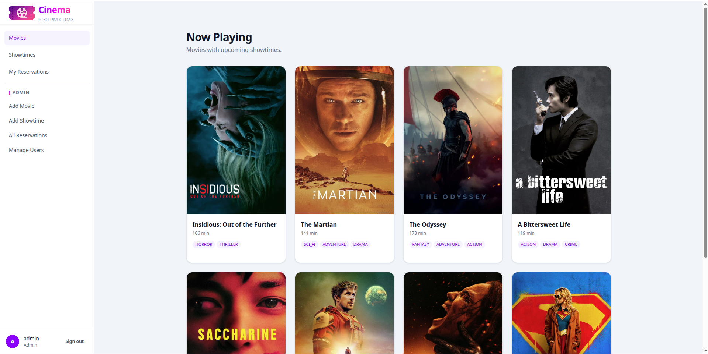

### Movie Details

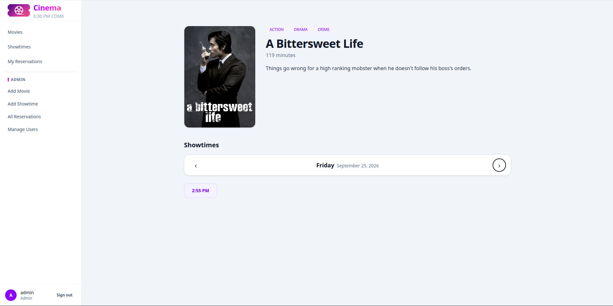

### Showtimes

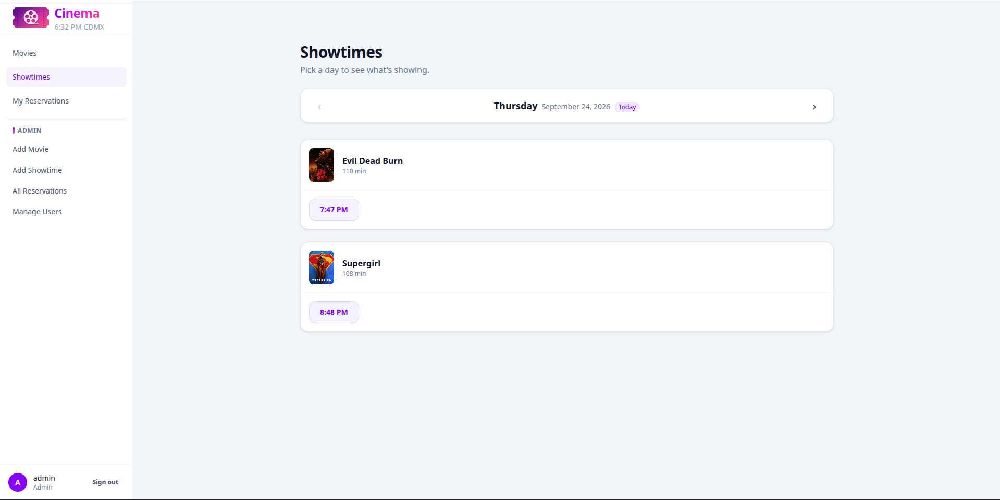

### Seat Selection

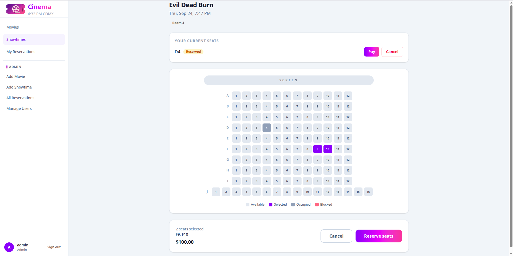

### Payment

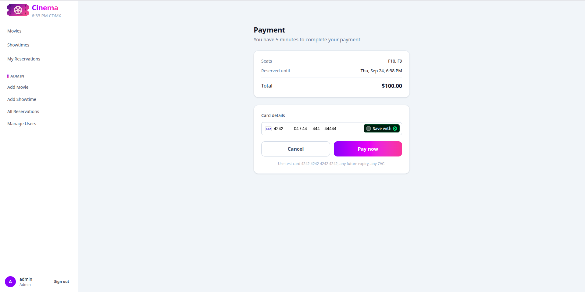

### Payment Confirmation

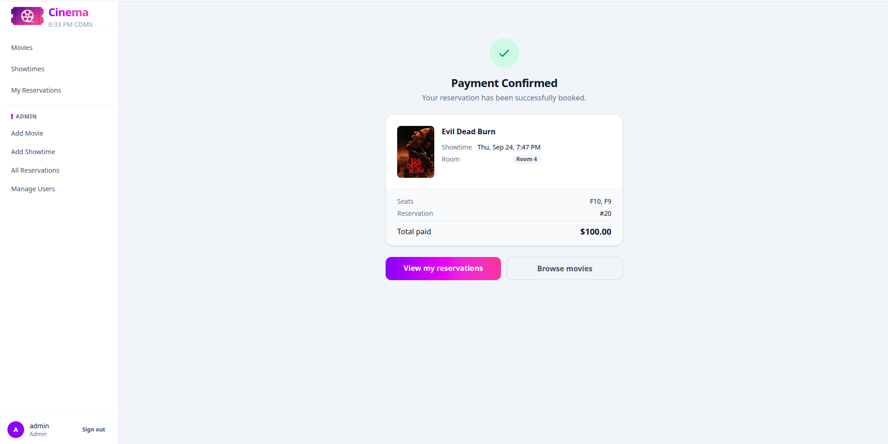

### My Reservations

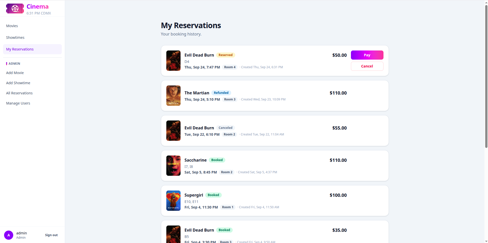

## Admin

### Add Movie

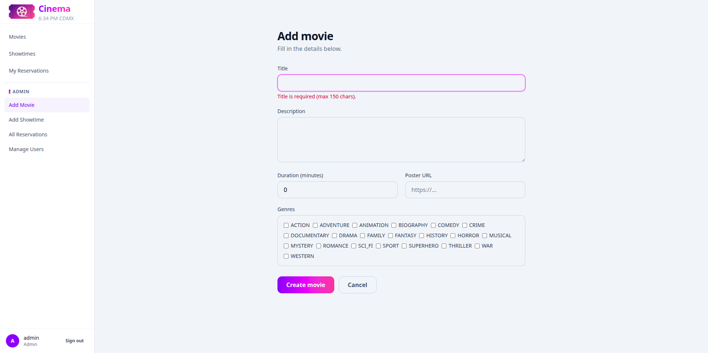

### Add Showtime

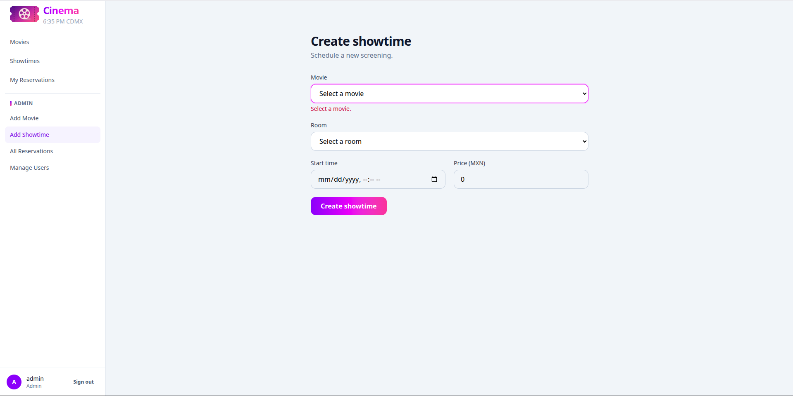

### All Reservations

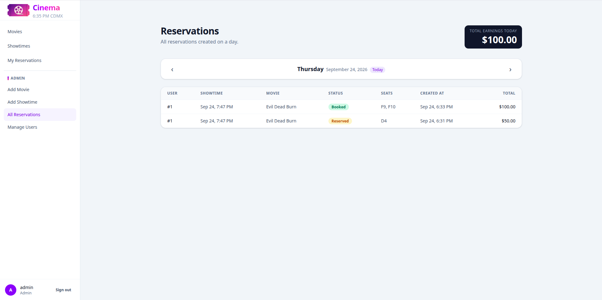

### Manage Users

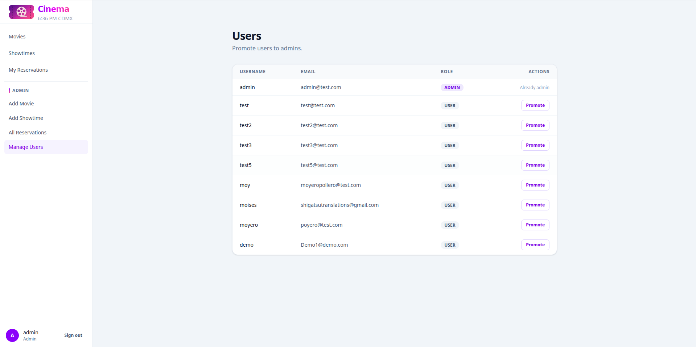

## Tech Stack

**Backend**

* Java
* Spring Boot
* PostgreSQL
* JWT
* WebSocket

**Frontend**

* Angular
* TypeScript

**Infrastructure**

* Docker
* Render
* Vercel
* Supabase
* Stripe

## Links

* [Live Demo](https://movie-system-five.vercel.app/)
